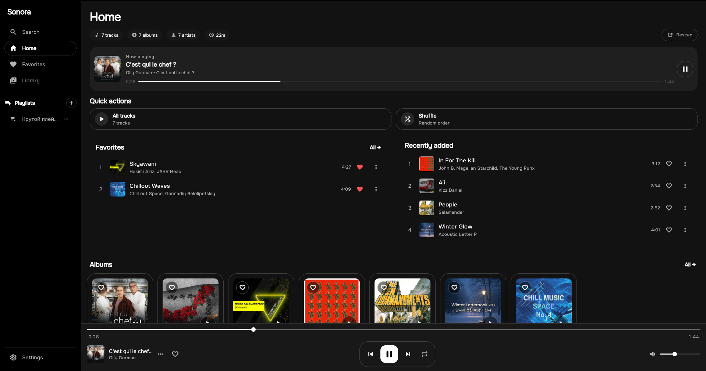
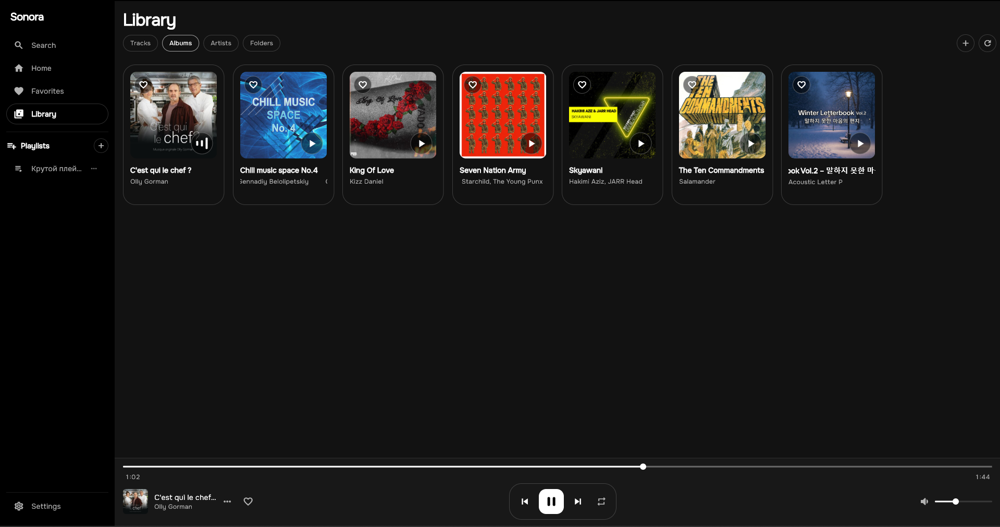
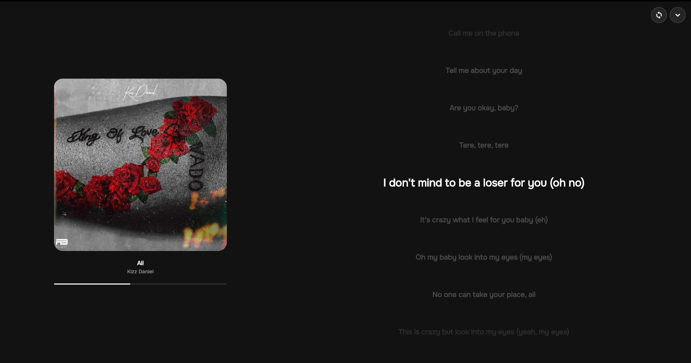

<p align="center">
  
</p>

<h1 align="center">Sonora</h1>

<p align="center">
  A fast, local-first music player built with Flutter.
</p>

<p align="center">
  <a href="https://github.com/Eli-Aqula/Sonora/releases"></a>
  <a href="LICENSE"></a>
</p>

---

Sonora plays the music you already have. Point it at your music folders and it
builds a local library — albums, artists, playlists, favorites — with synced
lyrics, cover art, and metadata editing, all backed by a local SQLite database.
No accounts, no streaming, no uploads.

> **Status:** **beta** (`v0.1.0-beta.1`). Core playback, library, lyrics and
> Genius integration work; expect rough edges and breaking changes between
> beta releases.

## Screenshots

| Home | Library | Now playing & synced lyrics |
|---|---|---|
|  |  |  |

## Download

Windows builds are published on the [**Releases**](https://github.com/Eli-Aqula/Sonora/releases) page:

- **`Sonora-Setup-<version>.exe`** — installer (recommended). Installs Sonora
  with a Start Menu shortcut and adds it to "Apps & features" for normal
  uninstall.
- **`Sonora-<version>-windows-portable.zip`** — portable build. Unzip anywhere
  and run `Sonora.exe` directly, no installation needed.

Linux and Android are currently build-from-source only (see [Getting started](#getting-started)).

## Features

- **Local library** — scans your music folders for `mp3`, `m4a`/`aac`, `flac`,
  `ogg` and `wav` files and organizes them into albums, artists and playlists.
- **Playback** — gapless audio playback powered by [media_kit](https://pub.dev/packages/media_kit) (libmpv).
- **Synced lyrics** — fetches time-synced lyrics from [LRCLib](https://lrclib.net) automatically,
  with a manual offset adjustment per track.
- **Genius integration (optional)** — look up artist bios, images and lyrics
  via the [Genius API](https://genius.com/api-clients) using your own API token.
- **Tag editing** — read and write track metadata (title, artist, album, cover
  art, etc.) directly from the app.
- **Favorites & playlists** — favorite tracks/artists and build custom playlists.
- **Search** — search your local library.
- **Cross-platform** — one codebase, adaptive desktop (Windows, Linux) and
  mobile (Android) layouts.

## Getting started

### Prerequisites

- [Flutter SDK](https://docs.flutter.dev/get-started/install) (stable channel, Dart SDK `^3.9.2`)
- Platform toolchains for whichever target you build:
  - **Windows**: Visual Studio with the "Desktop development with C++" workload
  - **Linux**: standard Flutter Linux desktop dependencies (`clang`, `cmake`, `ninja`, `pkg-config`, `libgtk-3-dev`)
  - **Android**: Android SDK / Android Studio

### Run

```bash
flutter pub get
flutter run -d windows   # or: -d linux, or an Android device/emulator
```

### Build a release

```bash
flutter build windows --release   # build/windows/x64/runner/Release/Sonora.exe
flutter build linux --release
flutter build apk --release
```

## Configuration

- **Music library**: add your music folders from within the app — Sonora scans
  them recursively for supported audio files.
- **Genius API token** (optional): open Settings, paste a token from
  [genius.com/api-clients](https://genius.com/api-clients), and enable
  auto-enrich to fetch artist art and lyrics during library scans.
- **Synced lyrics**: fetched automatically from LRCLib — no setup required.

## Tech stack

- [Flutter](https://flutter.dev) + [Riverpod](https://riverpod.dev) for state management
- [media_kit](https://pub.dev/packages/media_kit) for cross-platform audio playback
- [sqflite](https://pub.dev/packages/sqflite) (FFI on desktop) for the local library database
- [audiotags](https://pub.dev/packages/audiotags) for reading/writing audio metadata
- A small Rust module (via [flutter_rust_bridge](https://pub.dev/packages/flutter_rust_bridge)) for native helpers

## Versioning & releases

Sonora follows [Semantic Versioning](https://semver.org). While in beta,
versions are tagged as `vX.Y.Z-beta.N` (e.g. `v0.1.0-beta.1`); the `-beta.N`
suffix will be dropped once the project reaches a stable `v1.0.0`.

Pushing a `v*` tag to this repo triggers a GitHub Actions workflow that builds
the Windows app, packages the installer and a portable ZIP, and publishes them
on the [Releases page](https://github.com/Eli-Aqula/Sonora/releases). Tags
containing `-beta` (or any other pre-release suffix) are published as
**pre-releases**.

## License

Sonora is licensed under the [GNU Affero General Public License v3.0](LICENSE) (AGPL-3.0-or-later).
